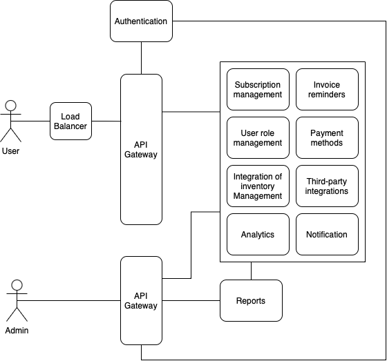

# OTT Platforms Portfolio
<dl>
<dt>Course Name</dt>
<dd>Algorithmic Problem Solving</dd>
<dt>Course Code</dt>
<dd>23ECSE309</dd>
<dt>Name</dt>
<dd>Sushant A Kulkarni</dd>
<dt>University</dt>
<dd>KLE Technological University, Hubballi</dd>
</dl>

## Table of Contents

- [Introduction](#introduction)
- [Market Analysis](#market-analysis)
- [Objectives](#objectives)
- [System Design](#system-design)
- [Business Cases](#business-cases)
- [Business Cases with Data Structures and Algorithms](#business-cases-with-data-structures-and-algorithms)
- [Efficiency Analysis](#efficiency-analysis)
- [References](#references)

## Introduction
Over-The-Top (OTT) platforms have revolutionized the way we consume media by providing content directly over the internet. Unlike traditional broadcasting, OTT platforms allow users to access a wide range of content, including movies, TV shows, and live events, on-demand. This shift has empowered viewers with greater control over what, when, and how they watch content. Major OTT players like Netflix, Amazon Prime Video, and Disney+ have set new standards for content delivery, quality, and user experience. Programming plays a critical role in the operation and evolution of OTT platforms. It involves the development of algorithms and data structures to manage vast libraries of content and provide seamless, personalized user experiences.
## Market Analysis
The Over The Top Market size is estimated at USD 0.58 trillion in 2024, and is expected to reach USD 1.99 trillion by 2029, growing at a CAGR of 28.19% during the forecast period (2024-2029). The Over-the-Top (OTT) market refers to delivering video, audio, and other media content over the Internet directly to users, bypassing traditional distribution channels like cable or satellite television. OTT platforms provide on-demand access to a wide range of content, including movies, TV shows, live events, and original programming.

- Over the top (OTT) is a film and television content platform provided via a high-speed internet connection instead of a cable or satellite provider-based platform. OTT adoption has significantly aided the video, music, podcast, and audio streaming category. Increasing adoption can be attributed to narrow genre choices, packaging flexibility, wider device availability, internet penetration, and lower costs. Furthermore, the rising demand for customized content led to significant adoption rates of OTT devices.
- The availability of high-speed internet connections, such as broadband and 4G/5G mobile networks, has played a crucial role in enabling seamless streaming experiences. While the increase in Internet users is a worldwide trend, regional variances exist.

## Objectives
- Identify Key Functionalities of OTT Platforms.
- Study Algorithms Utilized in OTT Platforms.
- Conduct Efficiency Analysis of OTT Algorithms.

## System Design

### Key Users:
- **End Users:** Individuals using various devices to access and stream content.
- **Content Providers:** Entities uploading and managing content on the platform.
- **Administrators:** Personnel managing the backend systems, content ingestion, user management, and system health monitoring.
- **Advertisers:** Businesses placing ads on the platform targeting specific user segments.

### Architecture:

#### Client Layer:
- **Devices:** Smart TVs, laptops, mobile phones, tablets, etc.
- **User Interface (UI):** Responsive and intuitive UI for content browsing, searching, and playback.

#### Content Delivery Network (CDN):
- **Third-Party CDNs:** Akamai, Cloudflare, etc., used for global content distribution.
- **Custom CDN:** Platform’s own CDN for optimized delivery, caching, and redundancy.

#### Backend Layer:
- **Content Management System (CMS):** Handles content ingestion, metadata tagging, and organization.
- **Transcoding and Encoding:** Converts video files into various formats and resolutions.
- **Distributed Storage:** Stores video content and metadata across multiple data centers.
- **User Management:** Manages user accounts, authentication, and profiles.
- **Recommendation Engine:** Provides personalized content suggestions using machine learning.
- **Analytics and Monitoring:** Tracks user interactions and system performance.

#### Scalability and Performance:
- **Microservices Architecture:** Decomposed services for flexibility and independent scaling.
- **Load Balancing:** Distributes requests to prevent server overload.
- **Elastic Compute:** Cloud-based resources for dynamic scaling.

#### Security and Compliance:
- **Data Encryption:** Protects user data and content in transit and at rest.
- **Digital Rights Management (DRM):** Secures content against piracy and unauthorized use.
- **Regulatory Compliance:** Ensures adherence to GDPR, COPPA, CCPA, and other regulations.

### Process:
#### Content Ingestion:
1. **Upload:** Content creators upload video files to the platform.
2. **Processing:** Files are transcoded and encoded into various formats and resolutions.
3. **Metadata Tagging:** Content is tagged with relevant metadata for organization and search optimization.
4. **Storage:** Processed content is stored in distributed storage for redundancy and quick access.

#### Content Distribution:
1. **Caching:** Content is cached on CDN nodes globally.
2. **Streaming:** When a user hits play, the content is delivered from the nearest CDN node.

#### User Interaction:
1. **Registration/Login:** Users create accounts or log in to access personalized features.
2. **Browsing/Search:** Users browse or search for content using the UI.
3. **Recommendations:** Personalized content recommendations are provided based on user behavior and preferences.
4. **Playback:** Users stream selected content on their devices.

#### Analytics and Optimization:
1. **Tracking:** User interactions and streaming performance are tracked.
2. **Analysis:** Data is analyzed to gain insights into user behavior, content popularity, and system performance.
3. **Optimization:** Continuous improvements are made to enhance user experience, streaming quality, and system efficiency.

## Business Cases
1. **Content Recommendation Engine**
2. **Search Optimization**
3. **User Watch History Management**
4. **Subscription Plan Optimization**
5. **Content Delivery Network (CDN) Optimization**
6. **Ad Placement Strategy**
7. **Content Popularity Prediction**
8. **User Segmentation**
9. **Load Balancing**
10. **Content Caching**
11. **User Session Management**
12. **Content Categorization**
13. **Personalized Notifications**
14. **Recently Viewed Content**
15. **Multi-Device Streaming**
16. **Transcoding**

## Business Cases with Data Structures and Algorithms
1. **Content Recommendation**
   - **Method:** ML techniques
   - **Algorithm:** K-Nearest Neighbours, Content Based filtering and collaborative filtering
   - **Description:** Recommends content based on user preferences and behavior patterns.
   - <a href="https://www.kaggle.com/code/heeraldedhia/movie-ratings-and-recommendation-using-knn">Code</a>
   - Reference image for recommendation
   - 

2. **Search Optimization**
   - **Data Structure:** Trie
   - **Algorithm:** Trie traversal algorithms (like <a href="https://github.com/Sushant-A-K/APS_Codes/blob/main/dfs.cpp">DFS</a> or <a href="https://github.com/Sushant-A-K/APS_Codes/blob/main/bfs.cpp">BFS</a>)
   - **Description:** Optimizes search queries to quickly retrieve relevant results.
   - 

3. **User Watch History Management**
   - **Data Structure:** <a href="https://github.com/Sushant-A-K/APS_Codes/blob/main/sll.c">Singly Linked List</a>
   - **Algorithm:** Insertion and deletion operations for maintaining watch history
   - **Description:** Tracks and manages the sequence of content watched by users.

4. **Subscription Plan Optimization**
   - **Data Structure:** Decision Tree
   - **Algorithm:** Decision tree algorithms (like <a href="https://www.geeksforgeeks.org/sklearn-iterative-dichotomiser-3-id3-algorithms/">ID3</a> or C4.5)
   - **Description:** Analyzes user data to recommend optimal subscription plans based on usage patterns.
     

5. **Content Delivery Network (CDN) Optimization**
   - **Data Structure:** Min-Heap (for prioritizing content delivery)
   - **Algorithm:** <a href="https://github.com/Sushant-A-K/APS_Codes/blob/main/dijkstra's.c">Dijkstra's Algorithm</a> (for shortest path in CDN routing)
   - **Description:** Optimizes CDN resource allocation and routing for efficient content delivery.

6. **Ad Placement Strategy**
   - **Data Structure:** Interval Tree (for managing ad slots)
   - **Algorithm:** <a href="https://github.com/Sushant-A-K/APS_Codes/blob/main/scheduling.py">Interval scheduling algorithms</a> (like Greedy Algorithm)
   - **Description:** Places ads strategically to maximize revenue based on user engagement and content relevance.

7. **Content Popularity Prediction**
   - **Data Structure:** <a href="https://github.com/Sushant-A-K/APS_Codes/blob/main/hash-map.cpp">Hash Map</a> (for counting content views)
   - **Algorithm:** Exponential Smoothing or Time Series Analysis
   - **Description:** Predicts future popularity of content based on historical viewing data.

8. **User Segmentation**
   - **Data Structure:** Clustering (like <a href="https://github.com/Sushant-A-K/APS_Codes/blob/main/kmeans.py">K-means</a>)
   - **Algorithm:** K-means clustering algorithm
   - **Description:** Groups users into segments based on behavior and preferences for targeted marketing and content recommendations.

9. **Load Balancing**
   - **Data Structure:** Queue (for managing incoming requests)
   - **Algorithm:** <a href="https://github.com/Sushant-A-K/APS_Codes/blob/main/round-robin.c">Round Robin</a> or Weighted Round Robin
   - **Description:** Distributes incoming traffic across servers to optimize resource utilization and response times.

10. **Content Caching**
    - **Data Structure:** LRU Cache (Least Recently Used)
    - **Algorithm:** <a href="lru.py">LRU</a> Cache eviction policy
    - **Description:** Stores frequently accessed content closer to users for faster retrieval and reduced server load.

11. **User Session Management**
    - **Data Structure:** <a href="https://github.com/Sushant-A-K/APS_Codes/blob/main/hash-table.c">Hash Table</a> (for storing session IDs and user details)
    - **Algorithm:** Session expiration and renewal algorithms
    - **Description:** Manages user sessions to maintain login state and personalized experiences.

12. **Content Categorization**
    - **Data Structure:** Tree (for hierarchical categorization)
    - **Algorithm:** Tree traversal algorithms (like <a href="https://github.com/Sushant-A-K/APS_Codes/blob/main/dfs.c">DFS</a> or <a href="https://github.com/Sushant-A-K/APS_Codes/blob/main/bfs.c">BFS</a>)
    - **Description:** Organizes content into categories and subcategories for structured browsing and search.

13. **Personalized Notifications**
    - **Data Structure:** <a href="https://github.com/Sushant-A-K/APS_Codes/blob/main/priority.cpp">Priority Queue</a> (for managing notification priorities)
    - **Algorithm:** Notification scheduling algorithms (like Delayed Notification Queue)
    - **Description:** Sends timely notifications to users based on their preferences and activities.
      

14. **Recently Viewed Content**
    - **Data Structure:** Stack (for storing recently viewed items)
    - **Algorithm:** <a href="https://github.com/Sushant-A-K/APS_Codes/blob/main/stack.c">Stack operations</a> (push, pop)
    - **Description:** Displays a list of recently viewed content items for quick access.

15. **Multi-Device Streaming**(Adaptive bitrate streaming)
    - **Data Structure:** <a href="https://github.com/Sushant-A-K/APS_Codes/blob/main/queue.c">Queues</a>
    - **Algorithm:** Streaming protocols (like HLS or MPEG-DASH)
    - **Description:** Enables seamless streaming across different devices while maintaining playback synchronization.

17. **Transcoding**
    - **Algorithm:** Transcoding algorithms like <a href="https://ffmpeg.org/">FFmpeg</a>
    - **Description:** Converts media content into different formats to ensure compatibility across various devices and bandwidth conditions.

## Efficiency Analysis

| Algorithm / Data Structure              | Time Complexity (Worst Case)           | Space Complexity (Worst Case)    |
|-----------------------------------------|----------------------------------------|----------------------------------|
| Singly Linked List (SLL)                | Access: O(n) Search: O(n) Insert at beginning: O(1) Delete at beginning: O(1) | O(n)                           |
| Depth-First Search (DFS)                | O(V + E)                               | O(V)                             |
| Breadth-First Search (BFS)              | O(V + E)                               | O(V)                             |
| Dijkstra's Algorithm                    | O((V + E) log V)                       | O(V)                             |
| K-means Clustering                      | O(n * k * I * d) where: n = number of data points k = number of clusters I = number of iterations d = dimensionality of data | O(n*k)*d)                         |
| k-Nearest Neighbors (kNN)               | O(n * d * log(n)) where: n = number of data points d = dimensionality of data | O(n*d)                             |
| Round Robin Scheduling                  | O(1) per time quantum                  | O(n)                             |
| Stack (Push and Pop operations)         | O(1) for both push and pop             | O(n)                             |
| Interval Scheduling Algorithm           | O(n log n)                             | O(n)                             |
| Hash Map (Average Case)                 | Insert: O(1) Search: O(1) Delete: O(1) | O(n)                             |
| Least Recently Used (LRU) Cache         | O(1) for both get and put operations   | O(capacity)                      |
| Queue (Enqueue and dequeue)             | O(1) for both enqueue and dequeue      | O(n)                      |
| Hash table (Average Case)               | O(1) for insertion, deletion and search| O(n)                      |

**Notes:**
- **SLL (Singly Linked List)**: Operations are listed for worst-case complexities.
- **DFS and BFS**: V is number of vertices, and E is number of edges.
- **K-means Clustering**: I is the number of iterations until convergence, and d is the dimensionality of the data.
- **Interval Scheduling Algorithm**: Assumes sorting intervals by their end times.
- **LRU Cache**: Capacity denotes the maximum number of items the cache can hold.
- **Hash map and hash table:** Worst case will be O(n) due to hash collisions

## References

1. <a href="https://www.geeksforgeeks.org/system-design-netflix-a-complete-architecture/">**System Design Netflix | A Complete Architecture**</a>
2. <a href="https://dev.to/binoy123/decoding-ott-unraveling-the-architecture-behind-seamless-streaming-36fa">**Decoding OTT: Unraveling the Architecture Behind Seamless Streaming**</a>
3. <a href="https://medium.com/@digital.vajidkhan/ott-platform-development-choosing-the-right-technology-stack-ad9b82b270d4">**OTT Platform Development: Choosing the Right Technology Stack**</a>
4. <a href="https://medium.com/@saurabh.codes/system-design-of-youtubes-architecture-ott-over-the-top-platforms-have-increased-video-8326d395f928">**System Design of YouTube’s Architecture**</a>

